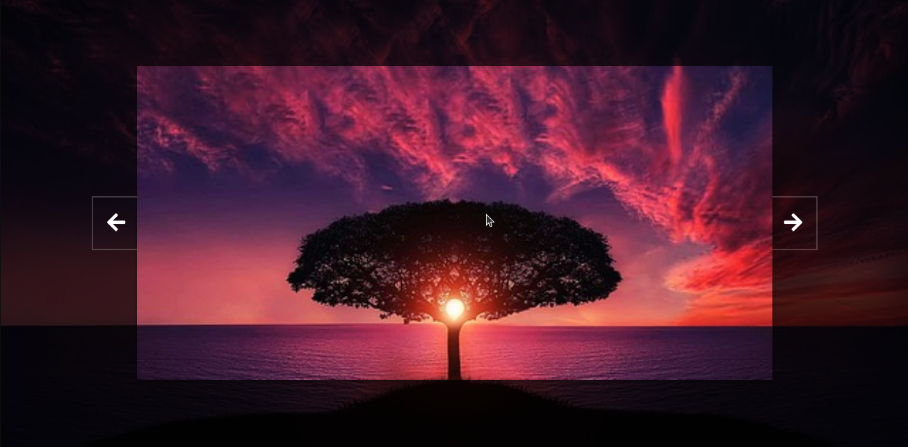

  

# Background Slider Wizardry 🌟

Welcome to the Background Slider Wizardry project! 🎩✨

## What's this magic all about?

This mystical repository is all about diving into the enchanting realm of background sliders using JavaScript. Whether you're a budding sorcerer of code or a seasoned wizard looking to refine your skills, this study project will take you on a spellbinding journey through the land of sliders.

## How to Unleash the Magic:

### 🧙‍♂️ Installation:

To harness the power of these background sliders:

1. **Clone the Repository at:**
    `https://github.com/tiagoskaterock/javascript-background-sliders`

2. **Open the Spellbook:**
    Explore the `index.html` and `script.js` to uncover the arcane incantations that bring these sliders to life.

### 🌌 Spells & Incantations:

Discover the ancient spells written in JavaScript within `script.js`. Dive deep into the incantations of `setBackground()` and `slideToNext()`, where the real magic happens!

### 🧪 Experimentation & Mastery:

Mix potions, tweak variables, and experiment with the code incantations to craft your own unique spells. Embrace the art of learning by tinkering and conjuring your variations.

## Join the Coven:

Feel free to join our mystical coven by contributing your own magical enhancements. Share your insights, findings, and even your own spells via pull requests. Together, we'll create a library of spells for aspiring sorcerers worldwide!

## 🧙‍♀️ Get in Touch:

Have a question about a spell? Want to share your own magical discoveries? Reach out to us at tiagolemespalhano@gmail.com We'd love to connect with fellow magic enthusiasts!

## Credits & Acknowledgments:

This project was conjured into existence by Tiago Lemes and inspired by the teachings of ancient coding scrolls found across Udemy on the internet.

May your code always compile, and your spells bring delight to the digital realm! 🌟✨

    

